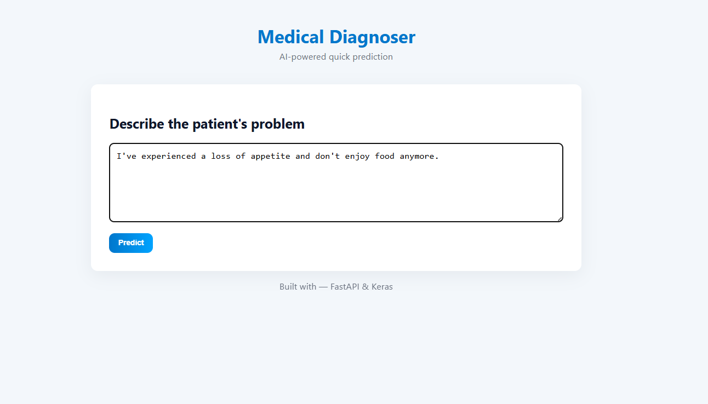
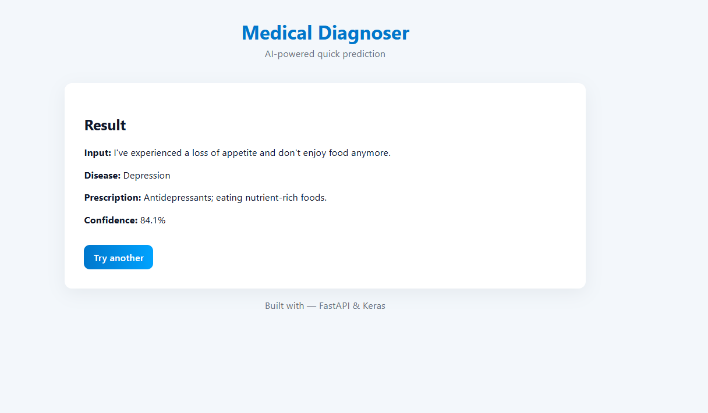

#  Medical Diagnoser – AI-Powered Disease Prediction System
---

## Overview

**Medical Diagnoser** is an **AI-powered web application** built using **FastAPI** and **Deep Learning (Keras)** to assist users in predicting possible diseases based on their symptoms.  
It also provides suggested prescriptions generated by the trained model.

This project demonstrates the integration of **Machine Learning**, **Natural Language Processing (NLP)**, and a **FastAPI backend**, forming a complete intelligent healthcare assistant.

---

## Features

-  **AI-Based Prediction** — Predicts diseases from user-input symptoms using a trained model.  
-  **Prescription Suggestions** — Suggests possible treatments or medications.  
-  **FastAPI Backend** — High-performance asynchronous backend.  
-  **Model Integration** — Supports TensorFlow/Keras models for inference.  
-  **Text Preprocessing & Tokenization** — Clean symptom data processing using NLP.  
-  **REST API Endpoints** — Can be integrated easily with any frontend or mobile app.  
-  **Auto Reload (Dev Mode)** — For rapid iteration during development.  

---

##  Project Architecture

```text
Medical Diagnoser/
│
├── main.py                # FastAPI main application
├── model/                 # Contains trained model (.h5), tokenizer, label files
├── service/               # Model loading and prediction logic
├── static/ or templates/  # (Optional) frontend assets
├── venv/                  # Virtual environment (ignored in Git)
├── requirements.txt       # Python dependencies
├── .gitignore
└── README.md



